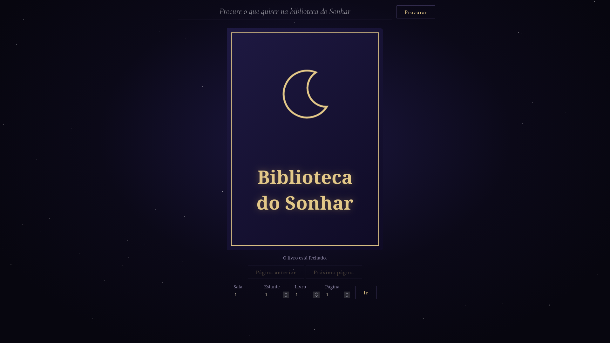

# Biblioteca do Sonhar

Uma releitura da [Biblioteca de Babel](https://libraryofbabel.info/search.html), com uma identidade visual inspirada no universo de Sandman.

### Explore livros infinitos com textos aparentemente aleatórios e descubra que tudo já está escrito na [**Biblioteca do Sonhar**](https://forrageador.github.io/biblioteca-do-sonhar/).

## Como funciona

As páginas são geradas por cálculos matemáticos no navegador, sem banco de dados. Cada endereço determina o conteúdo exibido. Voltar ao mesmo endereço gera o mesmo texto.

Ao pesquisar, o programa monta um par de páginas contendo a frase e calcula seu endereço usando a operação inversa da geração. Assim, consegue encontrar um resultado sem percorrer todos os livros.

A frase aparece destacada entre os demais caracteres e pode ocupar as duas páginas abertas, sem atravessar uma virada de folha. Você também pode informar um endereço completo para revisitar seu conteúdo, sem repetir a pesquisa.

As salas não possuem um limite máximo definido no código. Porém, como o alfabeto e o tamanho das páginas são limitados, a quantidade de textos diferentes é finita e os conteúdos podem se repetir em endereços distintos.

## Recursos

- Livro interativo com animações de abertura e virada de páginas.
- Pesquisa de até 2.000 caracteres, considerando o alfabeto permitido.
- Destaque visual da frase encontrada.
- Navegação por sala, estante, livro e página.
- 1.000 caracteres por página e 700 páginas por livro.

## Tecnologias

HTML, CSS e JavaScript, sem frameworks ou banco de dados.

## Sobre o projeto

Desenvolvido como projeto de estudo em Análise e Desenvolvimento de Sistemas, para praticar manipulação do DOM, animações, organização de código e geração determinística de texto.